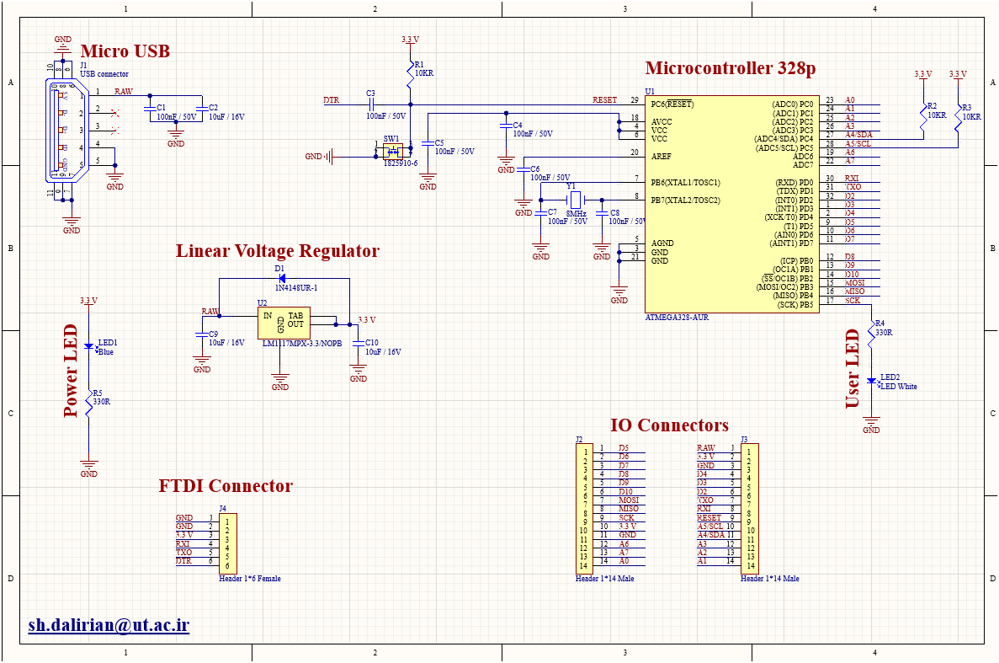
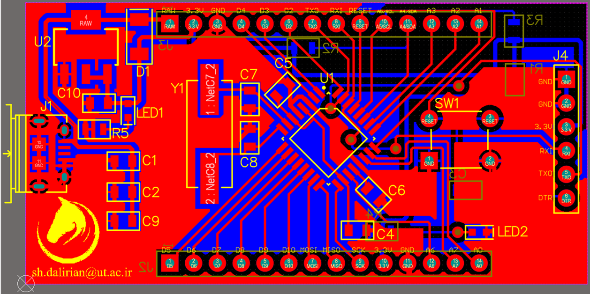
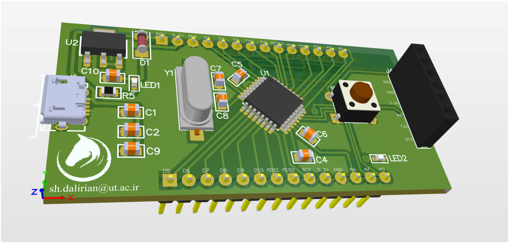
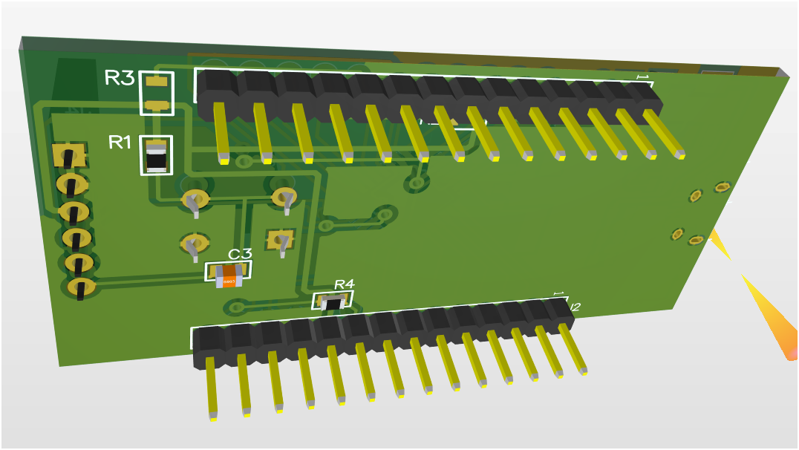

# PCB Design Project - Arduino Pro Mini Programmer

## Overview
This repository contains a fully designed and implemented PCB project created using **Altium Designer**. The project showcases advanced schematic design, PCB layout, and electrical engineering principles, optimized for programming Arduino Pro Mini. The design includes detailed schematics, an accurate Bill of Materials (BOM), and layout files prepared for manufacturing.

## Skills Demonstrated
- No pre-made templates or schematics were used; the design was developed entirely from scratch.
- Proficiency in **Altium Designer** for schematic and PCB design.
- Thorough understanding of electrical engineering principles.
- Attention to detail in creating high-quality, error-free designs.
- Ability to independently complete complex technical projects.
## Visuals
**Schematic Diagram**:

**PCB Top & Bottom Layers**:

**PCB Top & Bottom 3D**:

## Tools & Technologies
- **Altium Designer**: For schematic and PCB design.

## Contact me
If you have any questions or feedback, feel free to reach out:

📧 Email: sh.dalirian@ut.ac.ir

📂 LinkedIn: www.linkedin.com/in/shadi-d-30174b77
